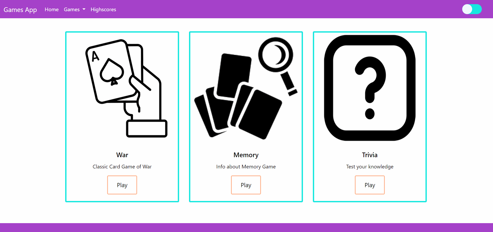

# Project 1 - Games App

- Used HTML, CSS, JQuery, Javascript, APIs, Ajax, Photoshop, Noun Project
- Over 300 commits with very few merge conflicts
- Each person had at least one game to code
- All collaborated on main page and highscores page
- End of game workflows were collaborative
- Met every evening for at least 2 hours
- Helped each other fix bugs in code
- Used google, stackoverflow, W3schools, MDNweb + TAs+ tutors

## Landing Page

## Contributors
 - Jessica Menius
 - Jim Mehta
 - Danielle Arias
 - Julia Hanlon
